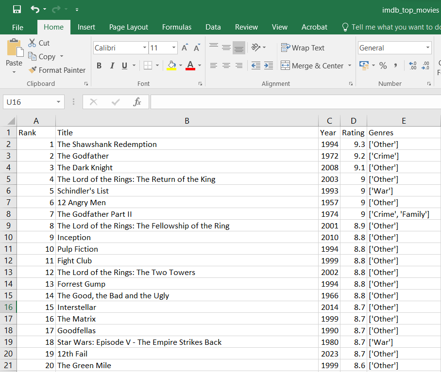

# IMDb Top 250 Scraper🎬

A Python-based web application that scrapes the **IMDb Top 250 movies** and displays them in an interactive, sortable, and filterable web dashboard.

This project uses **Selenium** for live scraping and **Flask** to serve a clean frontend interface.

---

## Features

-**Live Scraping** of IMDb Top 250 movies
-**IMDb Ratings, Year, Rank & Genres**
-**Sorting**
-Rating (High → Low, Low → High)
-Release Date (New → Old, Old → New)
-**Genre Filtering**
-**CSV Export**
-Automatically saves data to `imdb_top_movies.csv`
-**Modern UI**
-Built with HTML, CSS, and JavaScript

---

## Tech Stack

- **Python**
- **Flask**
- **Selenium**
- **Pandas**
- **WebDriver Manager**
- **HTML / CSS / JavaScript**

---

Installation

```bash
pip install -r requirements.txt
```

> ⚠️ Make sure **Google Chrome** is installed (required for Selenium).

---

## ▶️ Usage

### Run the Application

```bash
python app.py
```

### Open in Browser

```
http://127.0.0.1:5000
```

Click **Scrape Data** to fetch the latest IMDb Top 250 movies.

---

## 📁 Project Structure

```
IMDb_Scraper_Project/
│
├── app.py
├── imdb_top_movies.csv
├── requirements.txt
├── templates/
│   └── index.html
└── static/
    ├── style.css
    └── script.js
```

## Output Images




Author

**Vidhya Vinothkumar**
*vidhhya.2010@gmail.com*
